# 🏨 Hotel Ciudad de Martos 🏨
Práctica del tema 2 realizada por Eduardo Cruz Muñoz y Alberto Viveros (1º DAM).

# Índice

- INTRODUCCIÓN
- REQUISITOS MÍNIMOS
- DESCARGA
- MANUAL DE USUARIO
    - MENÚ PRINCIPAL
        - VER EL ESTADO DE OCUPACIÓN
        - RESERVAR UNA HABITACIÓN
        - REALIZAR EL CHECKOUT
            - FACTURA Y PAGO
            - CÁLCULO DEL CAMBIO
    - MENÚ DE ADMINISTRADOR
        - CONSULTAR INGRESOS Y RESERVAS
        - CONSULTAR LAS MONEDAS RESTANTES
        - VOLVER AL MENÚ PRINCIPAL
        - APAGAR EL SOFTWARE
- COLABORADORES

---

## INTRODUCCIÓN 📖
En este proyecto presentamos el software de gestión para el **Hotel Ciudad de Martos**, desarrollado como parte de la práctica obligatoria del Tema 2 para 1º DAM. La aplicación permite gestionar la ocupación de las habitaciones, realizar reservas, gestionar el checkout de los clientes y realizar tareas administrativas.

El hotel dispone de **10 habitaciones** en total, de las cuales 8 son dobles y 2 son individuales.

> [!NOTE]
> **Tarifas Oficiales:**
> * Habitación doble: 60€ por noche
> * Habitación individual: 45€ por noche

---

## REQUISITOS MÍNIMOS 💻
Para poder descargar y utilizar el programa, es necesario tener instalado el siguiente programa:
- Java Runtime Envrioment (JRE 25)

> [!WARNING]
> Si no tiene Java instalado o la versión es incorrecta, el programa no se ejecutará. Asegúrese de tener una versión compatible antes de continuar.

Para comprobar la versión de Java que tiene instalado debe realizar los siguientes pasos:
- Abrir la consola del Símbolo del sistema (buscar en la barra de búsqueda de Windows)
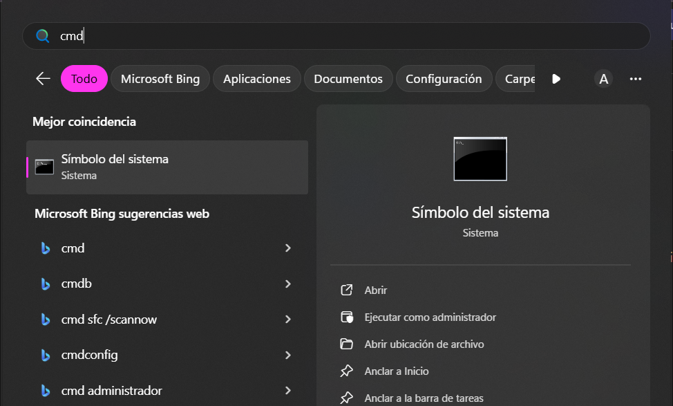

- Y a continuación, escribir el comando "java -version"
  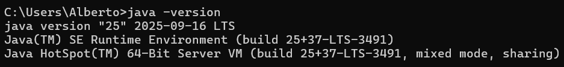

- En caso de no tener dicha version deberá descargarla:  
  https://www.oracle.com/es/java/technologies/downloads/#jdk25-windows

---

## DESCARGA 💾

Abra la pestaña de "Code", y dentro de las opciones descargue la carpeta comprimida en un archivo .ZIP en el botón "Download ZIP".
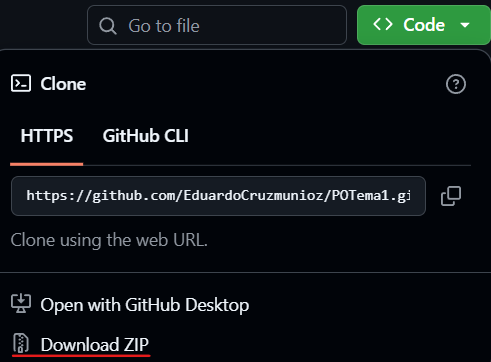

Nos dirigimos a la ubicación dónde tengamos la carpeta comprimida y la descomprimimos.
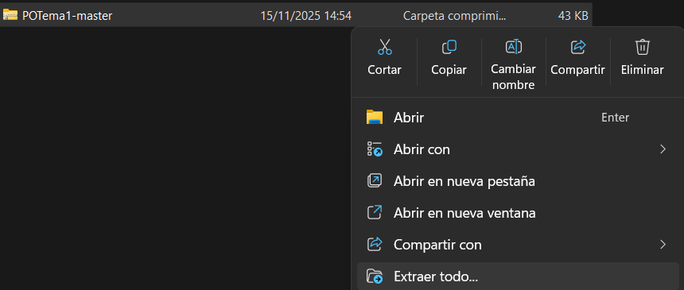

Siga la ruta de directorios hasta encontrar el archivo `.bat` (ejecutable para Windows).
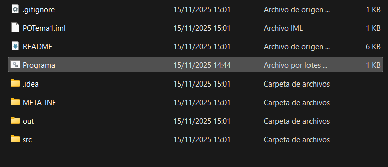

Este es el archivo ejecutable para iniciar el programa.
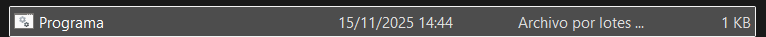

---

## MANUAL DE USUARIO 👨‍🏫
### MENÚ PRINCIPAL
En el menú principal tenemos 4 opciones:
a. Ver el estado de ocupación de las habitaciones
b. Reservar una habitación
c. Realizar el checkout de una habitación
d. Menú de Administrador

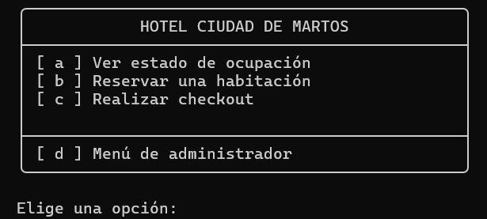

---
### VER EL ESTADO DE OCUPACIÓN
Al seleccionar la opción **(a)**, el programa mostrará el estado actual de las 10 habitaciones del hotel, indicando cuáles están libres y cuáles ocupadas.

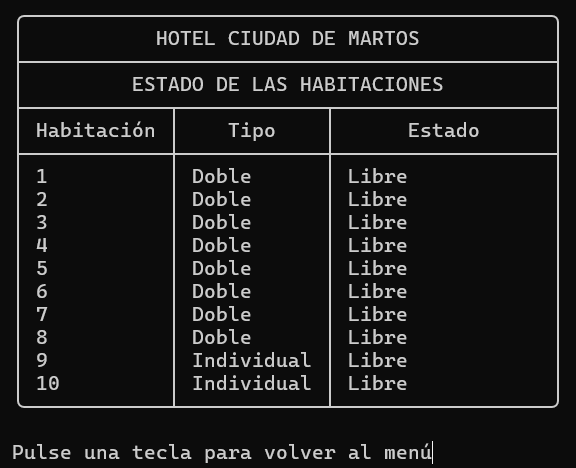

---
### RESERVAR UNA HABITACIÓN
Al seleccionar la opción **(b)**, se puede registrar una nueva reserva. El software registrará automáticamente la fecha de entrada y asignará una habitación (doble o individual) según la disponibilidad.

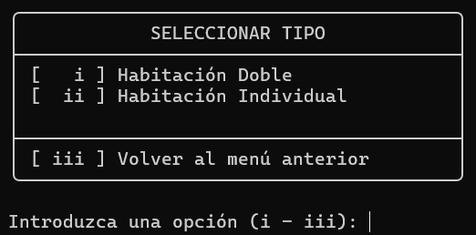

---
### REALIZAR EL CHECKOUT
Al seleccionar la opción **(c)**, se iniciará el proceso de salida de un cliente.

- **CÁLCULO DE ESTANCIA**: Para simular el paso de los días, el programa preguntará por el día de salida (en formato dd/MM/yyyy). Usando la fecha de entrada registrada y esta fecha de salida, el software calculará el número total de noches y el precio de la estancia.

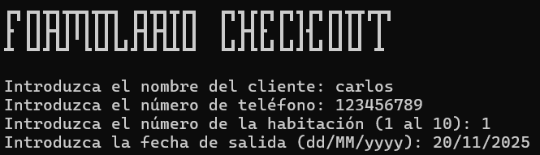

- **FACTURA Y PAGO**: Se generará una factura por pantalla con toda la información requerida (nombre, fechas, noches, tarifa, subtotal, IVA del 21% y TOTAL).

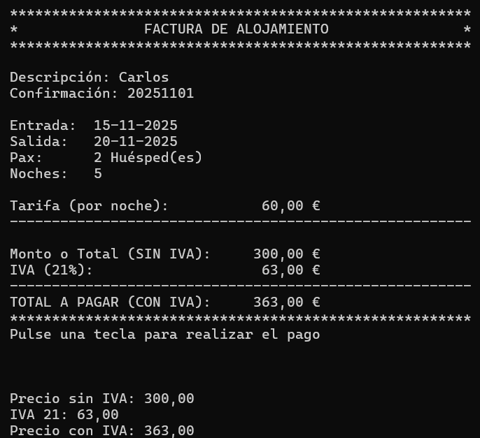

> [!NOTE]
> **PAGO AL CONTADO**
> A continuación, el programa solicitará al usuario que introduzca el dinero con el que se paga (solo se permite pago al contado).

- **CÁLCULO DEL CAMBIO**:
    - Si la cantidad introducida es insuficiente, el pago será rechazado y se volverá a solicitar.
      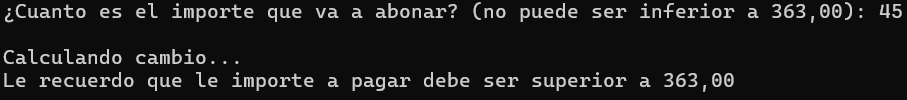
      - Si la cantidad es superior al total, el programa calculará el cambio a devolver.
    - Una vez el pago se ha completado, la habitación se marcará automáticamente como **libre**.

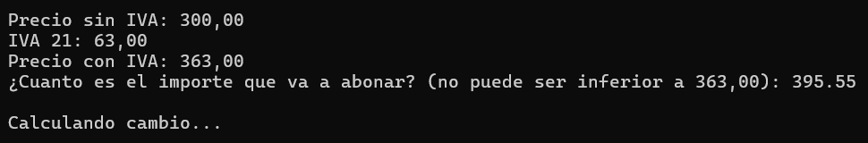

> [!TIP]
> **CAMBIO EFICIENTE**
> El cambio se calculará asegurando que se entrega en el **menor número de billetes y monedas posibles**.

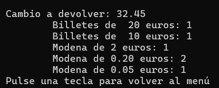

---
### MENÚ DE ADMINISTRADOR
Para acceder a la opción **(d)**, el software solicitará un **usuario y contraseña**. Si las credenciales son incorrectas, se denegará el acceso.

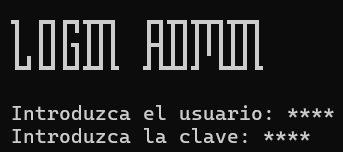

> [!IMPORTANT]
> **Credenciales de Acceso (Según el código):**
> (Credenciales necesarias para probar el programa)
> - USER: "**hola**"
> - PASSWORD: "**hola**"

Una vez dentro, el menú de administrador ofrece las siguientes opciones (según el código fuente):

- **i. Consultar los ingresos totales y el número de reservas finalizadas**.
  - Esta opción muestra el total facturado por el hotel y cuántos checkouts se han completado.
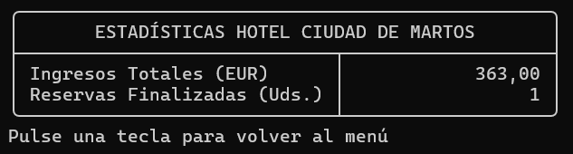

- **ii. Consultar las monedas restantes para el cambio**.
  - Esta opción muestra un desglose de los billetes y monedas disponibles en la caja.
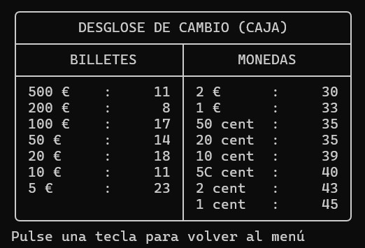

- **iii. Volver al menú principal**.
  - Esta opción sale del menú de administrador y regresa al menú principal del hotel.

- **iv. Apagar el software**.
  - Esta es la **únICA forma** de cerrar la aplicación. Al seleccionarla, el programa finalizará.
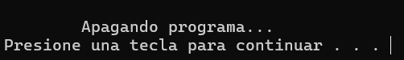

---

## COLABORADORES 🤝

- Eduardo Cruz Muñoz / Enlace GitHub: https://github.com/EduardoCruzmunioz
- Alberto Viveros / Enlace GitHub: https://github.com/AlbertoViveros
